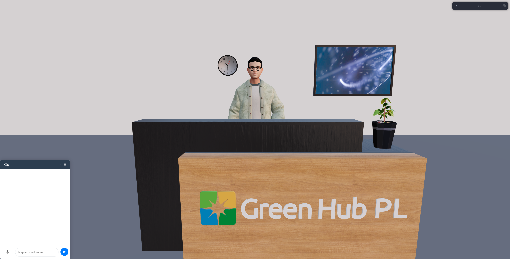

# AvatarAI

[Live Demo](https://avatar-ai-gray.vercel.app/)

## About

AvatarAI is an interactive AI avatar that you can engage in conversations with on various topics, with a particular focus on Renewable Energy Sources (RES). The avatar provides informative and engaging discussions about solar energy, wind power, hydroelectric energy, and other sustainable energy solutions.

## Features

- Real-time conversation with AI avatar
- Specialized knowledge in renewable energy topics
- Natural language processing for smooth interaction
- Responsive and user-friendly interface

## Technology

This project is built with:
- React
- Vite
- Convai API for avatar interactions

## Getting Started

To run this project locally:

1. Clone the repository
2. Install dependencies with `npm install`
3. Start the development server with `npm run dev`
